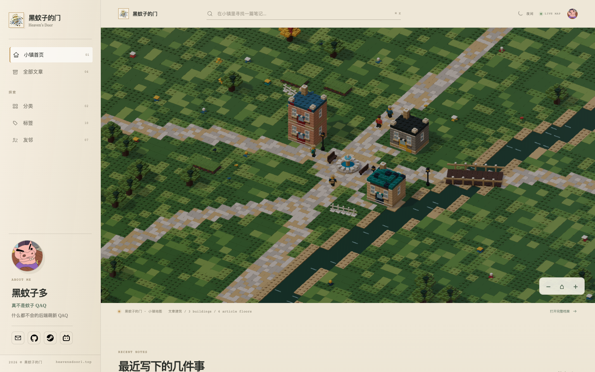
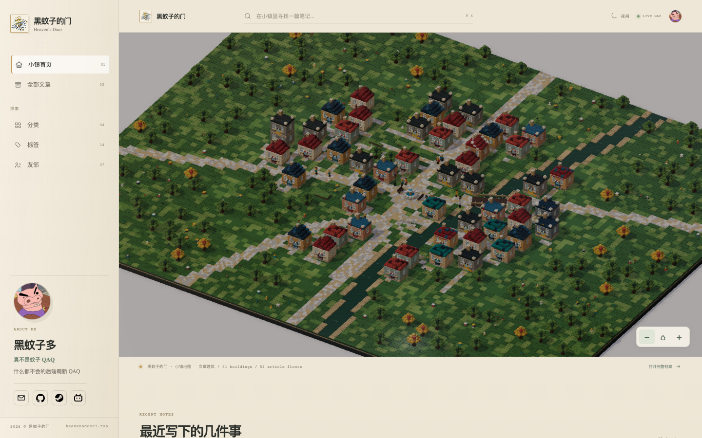
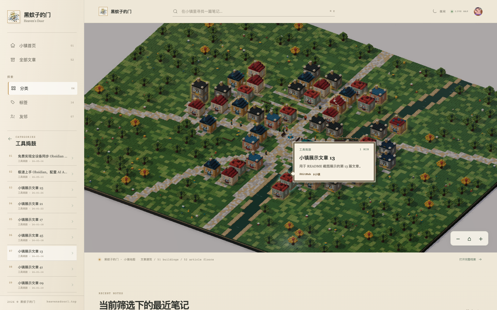

# Town Blog Framework

> 把博客变成一座会持续生长的积木小镇。

一个以 **Astro + React + Babylon.js** 构建的高性能静态博客框架：文章会在首页地图中生成建筑，系列文章会组成同一栋建筑的不同楼层。你可以像逛小镇一样探索内容，也可以通过传统的文章列表、分类、标签和搜索快速阅读。

<p align="center">
  
</p>

<p align="center">
  <em>文章不只是列表中的条目，而是小镇里可以被发现、被记住的一栋栋建筑。</em>
</p>

## 为什么是小镇？

博客通常会随着文章增多而变成长长的列表；Town Blog Framework 将这种增长转化为可视化的空间：

- **写一篇文章，就为小镇添一栋建筑。**
- **同一系列文章，组成同一栋建筑的不同楼层。**
- **分类、标签和文章列表，提供更高效的内容入口。**
- **小镇会随着内容增长变得更丰富，而不是越来越难以浏览。**

## 如何工作

### 从空地到小镇

文章数量增长后，小镇会自动生成更多建筑，并根据文章系列组织楼层。下面的示例展示了内容增多后的宽幅视图：

<p align="center">
  
</p>

### 用分类快速聚焦

不想逐栋探索时，可以直接使用分类、标签和文章列表。选中分类后，小镇、侧边栏和文章区域会同步切换到对应内容并高亮对应建筑。

<p align="center">
  
</p>

## 核心能力

- **交互式 3D 小镇首页**：通过地图、建筑和建筑提示探索文章。
- **Markdown 写作**：文章、图片和附件都可以直接放入仓库管理。
- **多种内容入口**：小镇、完整文章列表、分类、标签与搜索并存。
- **系列文章空间化**：同一系列共享建筑，系列索引对应楼层顺序。
- **持续增长的视觉反馈**：文章越多，小镇越丰富；支持普通建筑、特殊建筑和小镇角色活动。
- **响应式布局**：桌面端和移动端都保留核心阅读路径。
- **日间 / 夜间模式**：界面与小镇场景都会随模式切换。
- **集中配置**：网站信息、作者资料、社交链接和友链集中在一个配置文件中。
- **纯静态部署**：不依赖数据库，适合部署到 GitHub Pages、Cloudflare Pages、Netlify 等静态托管平台。

## 快速开始

### 1. 克隆并安装

```bash
git clone https://github.com/BURIBURI-ZAEMON1/Blog-Town
cd <项目目录>
npm install
```

### 2. 启动开发服务器

```bash
npm run dev
```

根据终端输出访问本地地址，即可预览小镇。后续可自行部署

### 3. 开始定制

1. 编辑 `src/config/site.ts`，填写网站名称、作者资料和正式域名。
2. 替换 `public/assets/profile/` 中的 Logo 与头像占位图。
3. 复制 `src/content/posts/_article-template.md.example`，创建第一篇文章。
4. 在 `src/config/site.ts` 中启用需要展示的社交网站链接或友链。
5. 运行完整检查并构建静态站点：

```bash
npm run verify
npm run build
```

完整的字段、资源目录、文章 frontmatter、社交链接和部署说明，请阅读：

➡️ [使用文档：docs/USAGE.md](docs/USAGE.md)

## 预置社交网站 Logo

框架已经在 `public/assets/links/` 中准备了国内外常用平台的向量 Logo，包括 GitHub、GitLab、X、Telegram、Discord、YouTube、Instagram、Threads、TikTok、微博、小红书、知乎、哔哩哔哩、Steam、Twitch、RSS、邮箱等。

选择要展示的平台时，只需删除对应配置行前面的 `//`，然后填入自己的链接

## 项目结构

```text
src/config/site.ts             站点、作者、相关链接与友链配置
src/content/posts/             Markdown 文章
public/assets/links/           预置及自定义相关网站 Logo
public/assets/friends/         友链头像或 Logo
public/assets/posts/           文章图片与附件
public/assets/profile/         网站 Logo 与作者头像
docs/USAGE.md                  面向使用者的完整文档
```

## 常用命令

```bash
npm run dev              # 启动开发服务器
npm run check            # Astro 与 TypeScript 检查
npm run build            # 构建静态站点
npm run verify           # 完整检查、构建和小镇回归测试
npm run preview          # 预览 dist/ 构建结果
```
